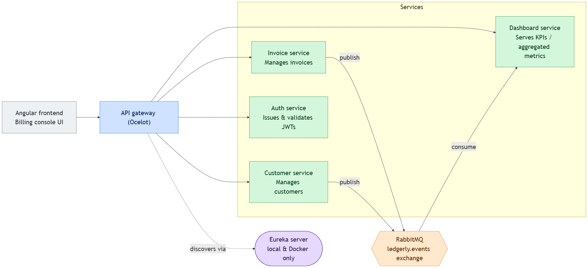

# .NET + Angular Microservices POC

A proof-of-concept microservices stack: four .NET backend services behind an
Ocelot API gateway, an Angular SPA frontend, and a Eureka service-discovery
server, for local/Docker runs. The same stack can also run on Kubernetes,
where Eureka is dropped in favor of native Kubernetes service discovery.

## Services



- Solid arrows are live request/response traffic; the dashed arrow is
  registration only. All four services also register with Eureka the same
  way the gateway does (omitted from the diagram to avoid clutter). Eureka is
  used in local & Docker modes only — on Kubernetes it's dropped in favor of
  Kubernetes DNS + ClusterIP, see
  [How service discovery works](#how-service-discovery-works).
- `invoice-service` and `cust-service` only **publish** to RabbitMQ
  (fire-and-forget — a broker hiccup is logged, never fails the request).
  `dashboard-service` is the only **consumer**, binding `invoice.*` /
  `customer.*` to `dashboard.kpi.queue` to keep its KPI table in sync.
- `auth-service` issues JWTs; the other three validate them locally against a
  shared signing key (config, not a runtime call to auth-service).

### Databases

Each of the four .NET services has its **own** SQL Server database — there is
no shared database. **All four databases live on the host machine**, even
when the services themselves run in Docker or Kubernetes — this keeps setup
simple (no containerized SQL Server to manage):

| Service | Database |
|---------|----------|
| Invoice service | `ledgerly-invoice` |
| Customer service | `ledgerly-customer` |
| Dashboard service | `ledgerly-dashbaord` |
| Auth service | `ledgerly-auth` |

### How service discovery works
- **Local / Docker:** services register themselves with **Eureka**, and the
  Ocelot gateway resolves downstream services by name through Eureka.
- **Kubernetes:** Eureka is removed. Each service is exposed by a Kubernetes
  **Service** (ClusterIP), and the gateway routes directly to those service
  names. ClusterIP load-balances across pods.

---

## Prerequisites

Install these on your host machine before running the project, in any mode:

1. **JDK** (Java 11+) — to build/run the Eureka server (`eureka-server/`).
   Needed for local and Docker modes; Kubernetes doesn't use Eureka.
2. **SQL Server Express** — all four databases run on the host in every mode
   (local, Docker, and Kubernetes). See [Databases](#databases) above.
3. **.NET 10 SDK** (Developer Pack) — to build/run the services locally. Note:
   `ledgerly-backend-invoice-service` targets `net6.0`, so the matching .NET 6
   runtime is required alongside .NET 10.
4. **RabbitMQ**, via Chocolatey — needed for local mode only (Docker Compose
   and Kubernetes each run their own RabbitMQ container):
   ```powershell
   choco install rabbitmq -y
   ```
   This pulls in Erlang as a dependency — **restart the RabbitMQ service**
   afterwards so it picks up the Erlang install:
   ```powershell
   Restart-Service RabbitMQ
   ```
5. **Create the databases** — run every script in [db/](db/) against your SQL
   Server instance (creates the four databases, schema, and seed data) before
   starting any service.

---

## Running the project

You can run the stack in three modes.

### 1. Local (dotnet + Eureka)

Start the Eureka discovery server first, then launch all the .NET services and
the frontend with the batch script.

```powershell
# 1. Start Eureka (in its own terminal; leave it running)
cd eureka-server
.\gradlew bootRun

# 2. From the repo root, build + start all services and the Angular frontend
run-all.bat
#   run-all.bat nobuild   # skip the build, just start everything
```

`run-all.bat` opens a separate window per service:

- invoice  → `https://localhost:7052`
- customer → `https://localhost:7099`
- dashboard→ `https://localhost:7063`
- auth     → `https://localhost:7109`
- gateway  → `https://localhost:7019`
- frontend → `http://localhost:4200`

> **Connection string:** each service reads `ConnectionStrings:DefaultConnection`
> from its own `appsettings.json` (e.g.
> `ledgerly-backend-invoice-service/appsettings.json`). Update the `Data Source`,
> `User ID`, and `Password` there to match your local SQL Server Express
> instance.

### 2. Docker Compose

Builds and runs every service — **including Eureka** — as containers on a shared
network. The database stays on the host machine (`host.docker.internal\SQLEXPRESS`).

```bash
# DB credentials come from a .env file (SQL_USER / SQL_PASSWORD)
docker-compose up --build
```

Exposed ports: frontend `4200`, gateway `8080`, invoice `5052`, customer `5246`,
dashboard `5208`, auth `5109`, Eureka `8761`. Services wait for Eureka to be
healthy before starting.

> **Connection string:** copy `.env.example` to `.env` and set `SQL_USER` /
> `SQL_PASSWORD`, plus one connection string per service — `INVOICE_DB`,
> `CUSTOMER_DB`, `DASHBOARD_DB`, `AUTH_DB`. These are injected into each
> container as `ConnectionStrings__DefaultConnection`.

### 3. Kubernetes

On Kubernetes **Eureka is not used**. Instead, each deployment is exposed by a
Kubernetes Service, and the API gateway routes traffic directly to those
services (Kubernetes DNS + ClusterIP handle discovery and load-balancing).
Every service has its **own Deployment**, so each can be scaled independently
for maximum scalability (with HPAs autoscaling on CPU).

A single **Ingress** is what allows connections into the Kubernetes cluster from
outside — it is the only public entry point. It routes by path, and the most
important entry point is **`/`**, which points to the Angular frontend (the
`/InvoiceGW`, `/CustomerGW`, `/Dashboard`, `/AuthGW` paths go to the gateway).

> **Connection string:** copy `k8s/01-db-secret.example.yaml` to
> `k8s/01-db-secret.yaml` and fill in the `ConnectionStrings__DefaultConnection`
> value in each of the four secrets. For local minikube testing, point at
> `host.minikube.internal,1433` (not the `\SQLEXPRESS` named instance, and not
> an AKS/cloud DB) — see the comments in the example file for the one-time SQL
> Server Express config this requires.

```bash
kubectl apply -k k8s/

# route local traffic to the ingress controller (instead of using `minikube tunnel`)
kubectl port-forward -n ingress-nginx service/ingress-nginx-controller 8090:80
```

Then open the app at **<http://myapp.local:8090>** (after mapping `myapp.local`
to the minikube IP in your hosts file — see the k8s README).

See **[k8s/README.md](k8s/README.md)** for full details — image builds, the DB
secret, ingress setup, autoscaling, and moving to a cloud provider.
